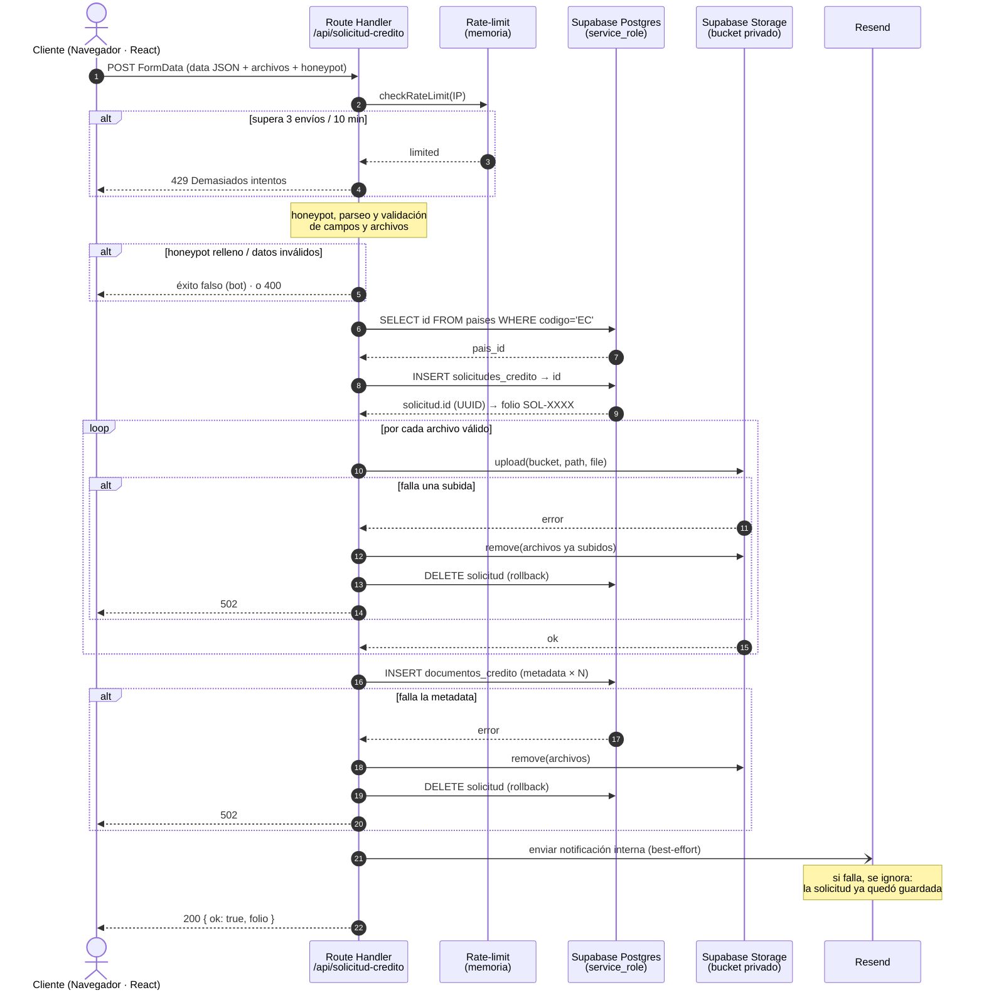

# Flujo — Solicitud de crédito pública

Diagrama de **secuencia** del envío de una solicitud de crédito, desde el
navegador hasta que queda guardada en Supabase. Incluye las tecnologías de cada
capa y la lógica de rollback.

> Para verlo renderizado: preview de Markdown con soporte Mermaid (GitHub lo
> renderiza solo; en VS Code, la extensión "Markdown Preview Mermaid Support").

## Tecnologías por capa

| Capa | Tecnología |
|------|-----------|
| Cliente | React 19 + Next.js (App Router), `fetch` con `FormData` |
| Endpoint | Next.js Route Handler (`app/api/solicitud-credito/route.ts`), Node server |
| Anti-abuso | Rate-limit en memoria + honeypot + validación server-side |
| Base de datos | Supabase Postgres (tablas `solicitudes_credito`, `documentos_credito`, `paises`) |
| Archivos | Supabase Storage — bucket privado `documentos-credito` |
| Autorización | `service_role` (sobrepasa RLS), solo en el servidor |
| Correo | Resend (notificación interna, best-effort) |

## Diagrama

